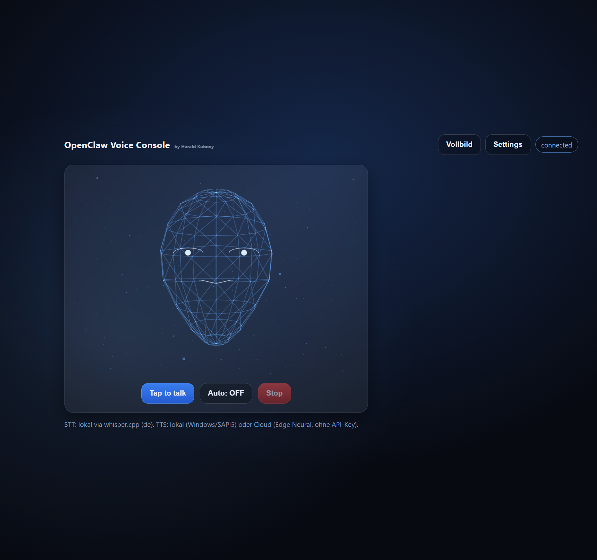
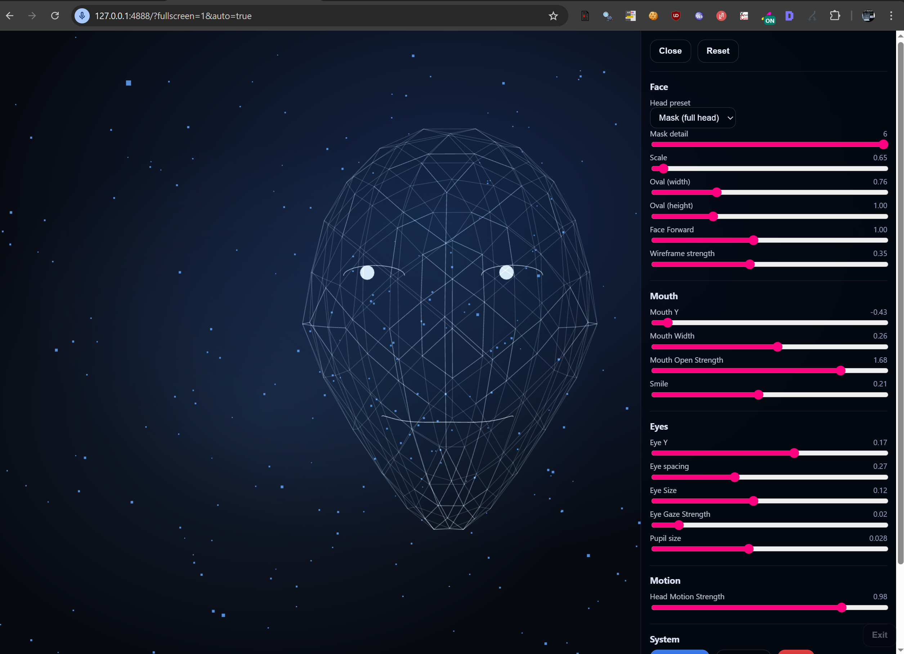

# OpenClaw Voice Console (Windows)

A local-first voice mode for OpenClaw:

- **STT (local):** `whisper.cpp` (optional, offline)
- **TTS (local):** Windows SAPI5 voices
- **TTS (no API key):** Microsoft Edge Neural voices via `edge-tts`
- **UI:** Sci‑fi console + wireframe face + particles + kiosk/fullscreen + live tuning sliders

> Status: V1 (works, still evolving)

## Requirements

- Windows 10/11
- Node.js 18+ (recommended: 20+)
- Python 3.10+ (recommended: 3.12)
- OpenClaw gateway running locally

Optional (for local STT):
- `whisper-cli.exe` from whisper.cpp + a model file

## Install

### Windows

```powershell
git clone <THIS_REPO_URL>
cd openclaw-voice-console
python -m pip install --upgrade edge-tts
.\start_voice_console.ps1
```

Open:
- http://127.0.0.1:4888/

### Debian / Raspberry Pi OS (Linux)

```bash
git clone <THIS_REPO_URL>
cd openclaw-voice-console

# deps
sudo apt update
sudo apt install -y nodejs npm python3 python3-pip

# edge tts (no api key)
python3 -m pip install --user --upgrade edge-tts

# run (token required)
export OPENCLAW_TOKEN="..."
./start_voice_console.sh
```

Open:
- http://127.0.0.1:4888/

Notes:
- On Linux, TTS defaults to **Edge Neural** (Windows SAPI voices are Windows-only).
- Local STT requires `whisper-cli` + a model; see below.

## Screenshots

Add your screenshots here:
- `screenshots/screenshot_1.png` (normal)
- `screenshots/screenshot_2.png` (fullscreen)

Once they exist, the images below will render on GitHub:




## Usage

### Talk
- Tap/click **Tap to talk**
- In fullscreen, press **Space** to toggle push‑to‑talk

### Fullscreen / Kiosk
- Button: **Vollbild**
- Hotkeys:
  - **F** toggle fullscreen layout
  - **S** / **F1** toggle Settings drawer overlay
  - **ESC** exit fullscreen

You can also force exit sticky fullscreen:
- `http://127.0.0.1:4888/?fullscreen=0`

### Settings drawer
Use sliders to tune the face (oval/scale/forward), eyes (gaze/pupils), mouth (smile/open), motion, etc.
Settings persist in browser `localStorage`.

## Local STT (whisper.cpp)

This repo contains helper scripts, but it does **not** ship large binaries/models in normal commits.

You need:
- `bin/whisper-cli.exe`
- `models/<ggml-model>.bin` (e.g. `ggml-small.bin`)

### Linux note

For Linux you’ll want a **Linux** `whisper-cli` binary (not the Windows `.exe`).
You can either build it from whisper.cpp or ship a separate linux binary (Release asset).

### Recommended: download from GitHub Releases (includes exe + model)

On the GitHub repo page:
1) Go to **Releases** → **Create a new release**
2) Upload a ZIP that contains:
   - `bin/whisper-cli.exe`
   - `models/ggml-small.bin`
3) In the README/release notes, tell users to extract the ZIP into the repo root.

This way everyone gets a one‑download setup, without bloating the git history.

Then the console will use `/api/stt` locally.

## Security notes

Do **NOT** commit these files:
- `device.json` (contains private key)
- model binaries (`*.bin`), executables (`*.exe`/`*.dll`)

This repo’s `.gitignore` excludes them.

## License

MIT (recommended). Add/adjust as needed.
